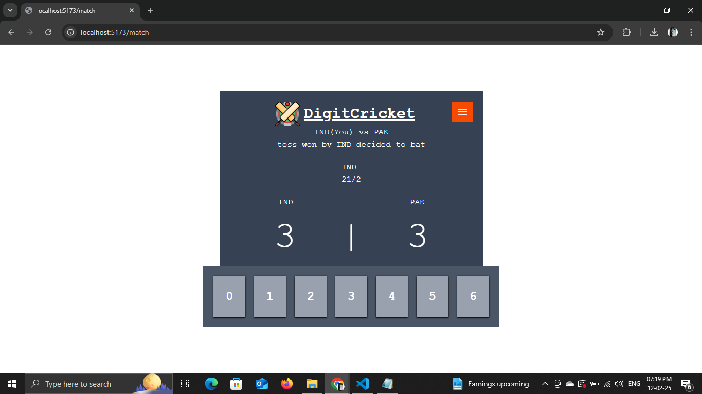
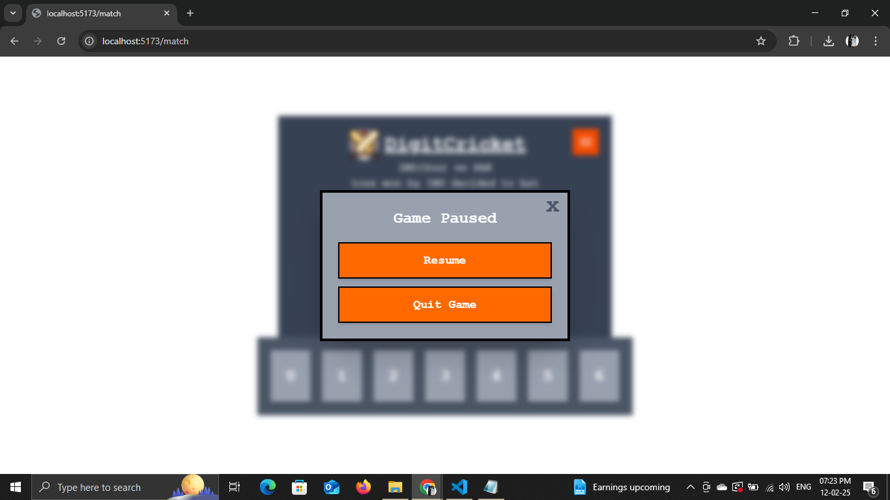
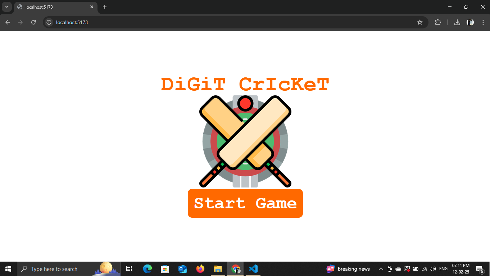
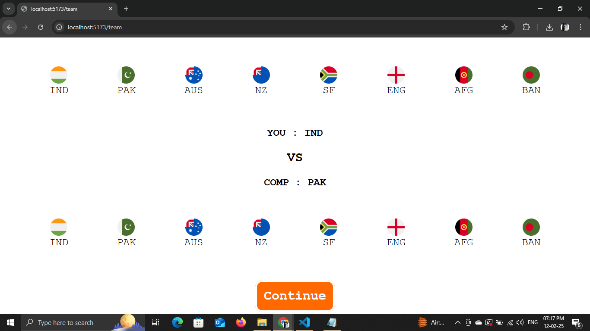
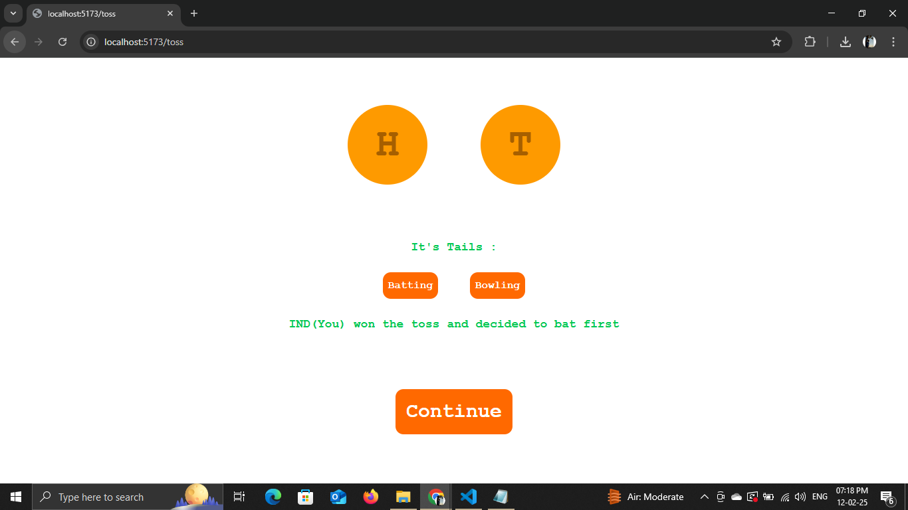

# DigitCricket - Hand Cricket Web Game

## 🎮 About the Project

This is a modernized web-based version of the classic *Hand Cricket* game, where players use their fingers to score runs and take wickets. The game features an AI opponent, team selection, a toss mechanism, and an interactive gameplay experience.

## ✨ Features

- **Classic Hand Cricket Rules**: Play with the traditional rules where matching numbers result in wickets.
- **Computer Opponent**: Challenge a probability-based computer opponent, where outcomes are determined based on a fair randomness system.
- **Team Selection**: Choose from teams like India, Australia, England, Pakistan, and more.
- **Toss Simulation**: Decide to bat or bowl first based on a toss outcome.
- **Intuitive UI**: Engaging and easy-to-use interface for seamless gameplay.

## 🚀 How to Play

1. Select your team and the computer's team as well.
2. Perform a toss to decide who bats or bowls first.
3. Use numbers (0 to 6) to play each ball:
   - If numbers don’t match, the batting player gets that many runs.
   - If numbers match, it’s a wicket!
4. The game continues until 10 wickets fall.
5. The second player then chases the target to win the game.

## 🛠️ Installation & Setup

1. Clone this repository:

   ```sh
   git clone https://github.com/Aman-Ingale/Digit-Cricket.git
   ```

2. Navigate to the project directory:

   ```sh
   cd Digit-Cricket
   ```

3. Install dependencies:

   ```sh
   npm install  # If using Node.js (Make sure to install `react-router-dom` and `tailwindcss` as well.)
   ```

4. Run the project:

   ```sh
   npm run dev  # For development
   ```

## 📷 Screenshots

### Game Page



### Starting Page


### Team Selection Feature


### Toss Feature



## 💬 Feedback & Suggestions

We'd love to improve **DigitCricket** based on your feedback! 🚀  
If you have any suggestions, feature requests, or find any bugs, feel free to comment below or open an issue in the repository.

📩 You can also reach out via [LinkedIn](https://www.linkedin.com/in/aman-ingale-058b80301?utm_source=share&utm_campaign=share_via&utm_content=profile&utm_medium=android_app) or [GitHub Issues](your-https://github.com/Aman-Ingale/Digit-Cricket.git/issues).

---

